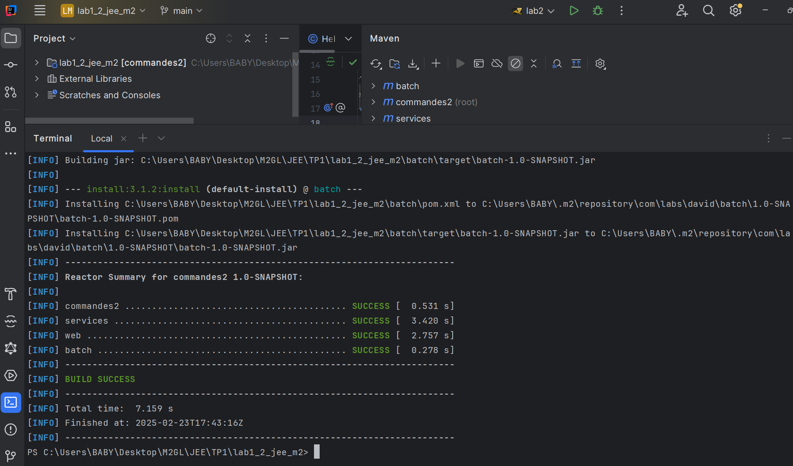
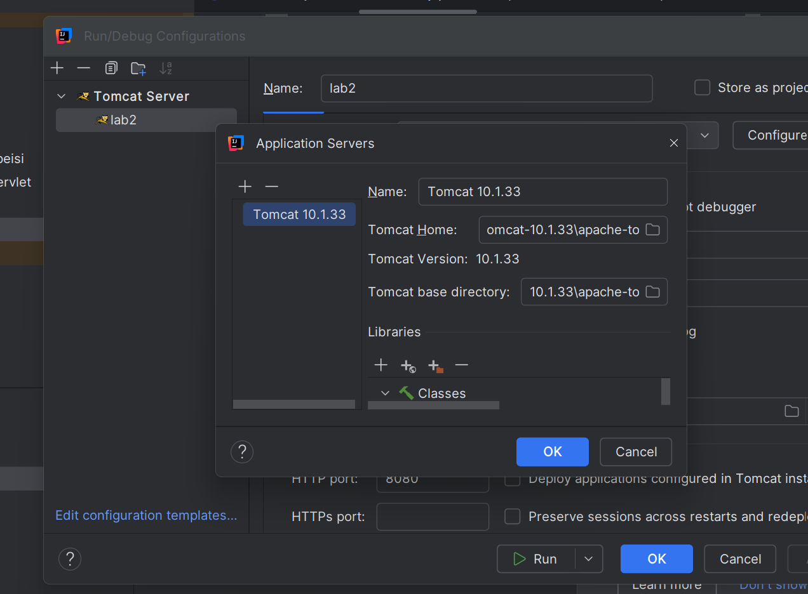
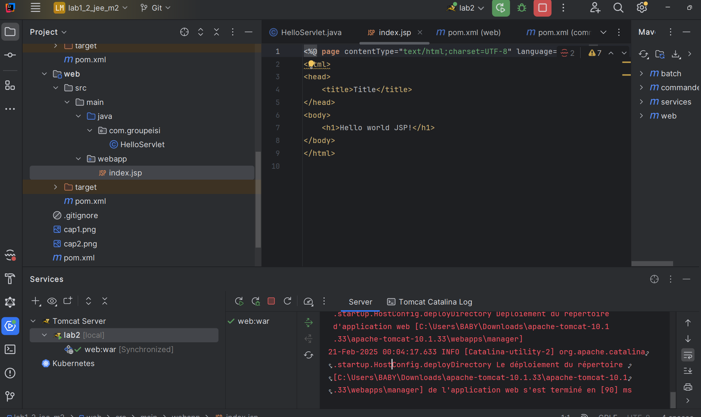
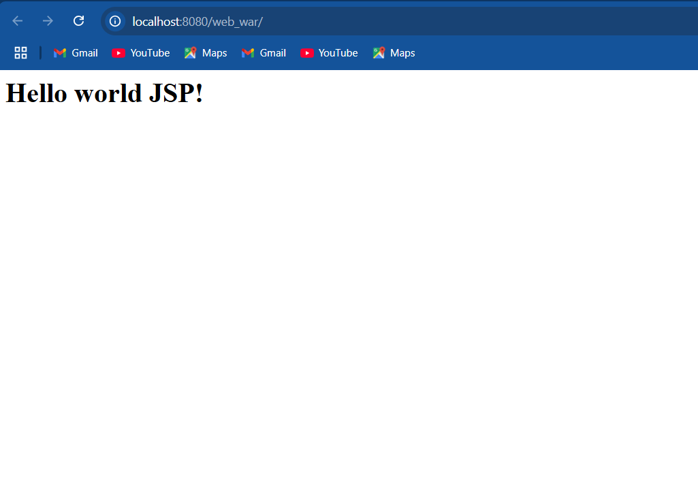
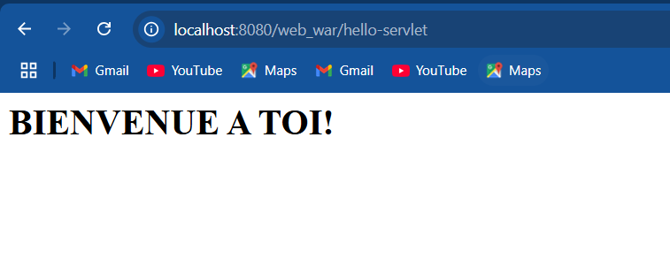

# 1️⃣ Prérequis
Avant de commencer, assurez-vous d'avoir installé :

```bash
- Java 17+
- Maven 3.9
```

## 2️⃣ Construire le projet

💡 Compilateur tout le projet :
```bash
mvn clean install
```



## Building

➤ Configuration de Tomcat :



➤ Definition du port :


➤ Execution de l'application :



➤ Accès à l'application  : http://localhost:8080/web_war/hello-servlet


