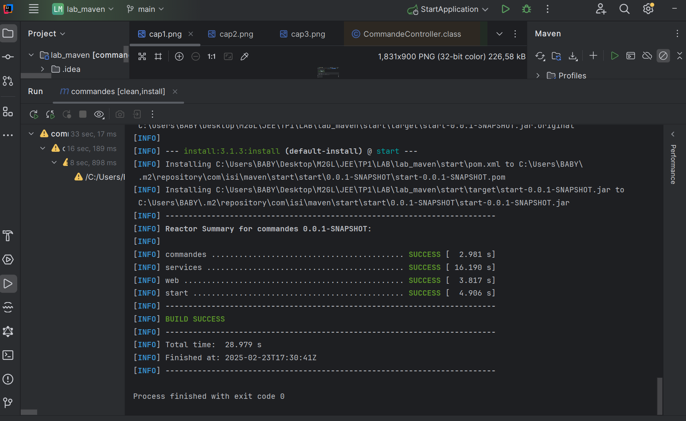
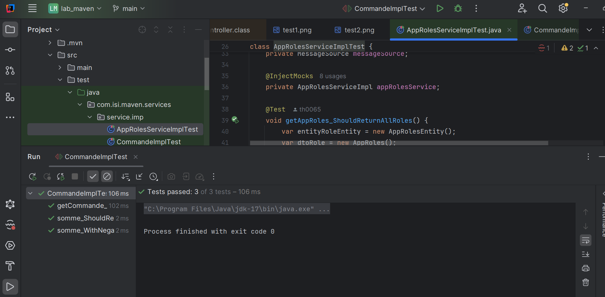
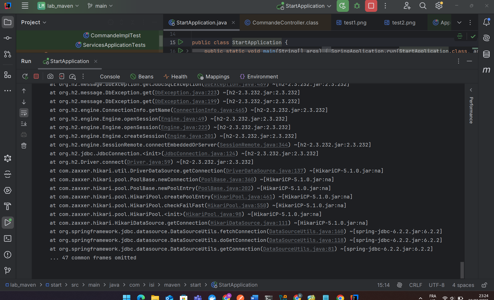
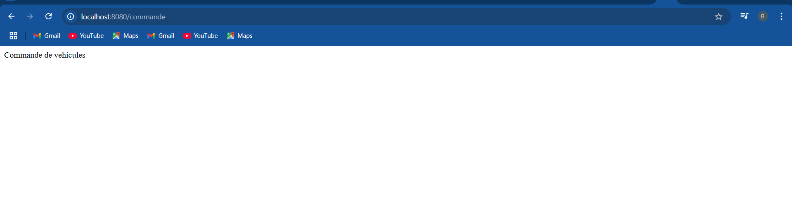

# 1️⃣ Prérequis
Avant de commencer, assurez-vous d'avoir installé :

```bash
- Java 17+
- Maven 3.9
- Node.js 22 et npm 10 (pour Angular)
```

## 2️⃣ Construire le projet

💡 Compilateur tout le projet :
```bash
mvn clean install
```



## Building

➤ Lancement les test unitaires :



➤ Execution de l'application :



➤ Resultat de l'execution de L'application : http://localhost:8080/commande

