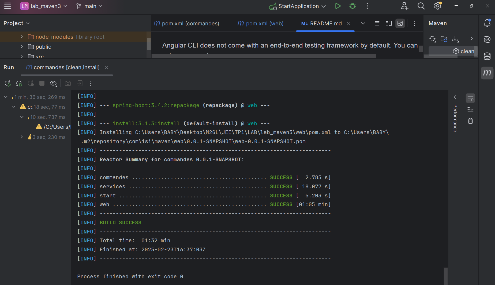
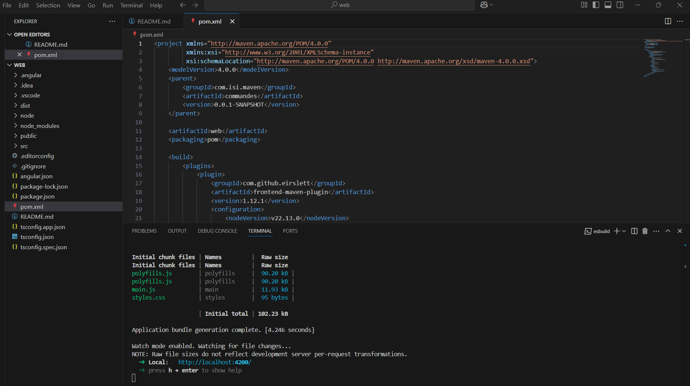
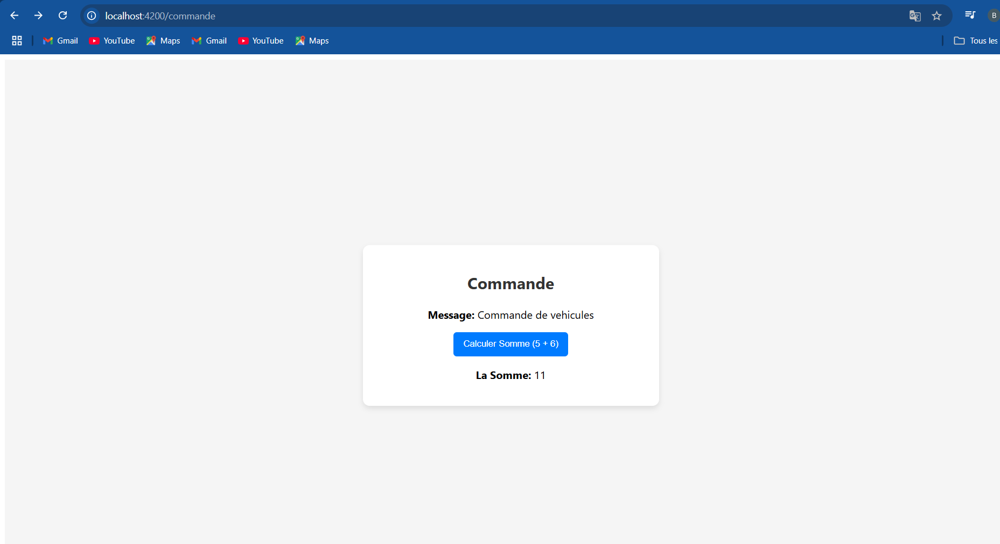

# 1️⃣ Prérequis
Avant de commencer, assurez-vous d'avoir installé :

```bash
- Java 17+
- Maven 3.9
- Node.js 22 et npm 10 (pour Angular)
```

## 2️⃣ Construire le projet

💡 Compilateur tout le projet :
```bash
mvn clean install
```
Cela construira tous les modules (services et web).

💡 Compiler un module spécifique :

```bash
mvn clean install 
```


## Building

➤ Installer les dépendances :

```bash
cd web
npm install
```

➤ Lancer l'application Angular :

```bash
npm start
```


➤ Accès à l'application : http://localhost:4200/commande

